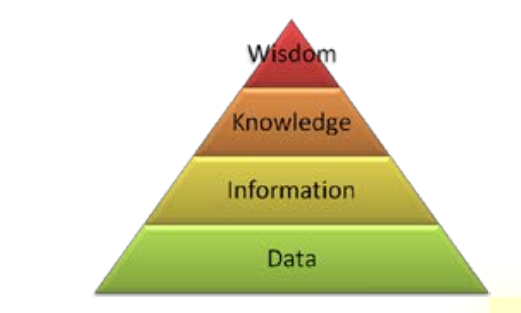
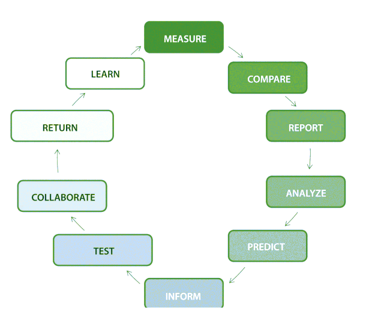
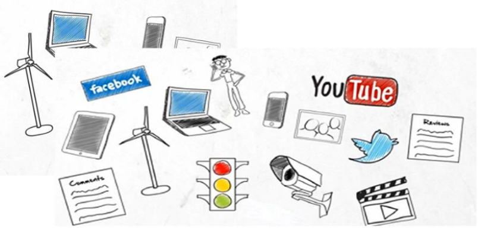
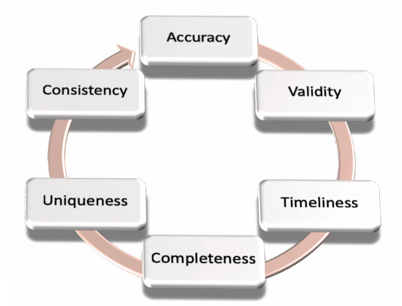

### INTRODUCTION
Managing to obtain the real value of the data is not an easy task. We collect and store data that
comes from multiple channels, which are often stored in different information systems and
databases rather than heterogeneous technology environments and formats. Even if we have
direct access to the data, it is difficult to have it when, where and how we need it, but in addition
the data is often "dirty", meaning it is full of errors, omissions and inconsistencies.

One of the main objectives of data management is to ensure
that the data is fit for purpose.

The collection, cleaning and wrangling of data can consume up to 80% of the time in a
business. To get "brilliant" insights or discoveries, we must work with data that meets quality
standards.

Data is the representation of facts such as text, numbers, graphics, images, sound or video.
The facts are captured, stored and expressed as data. The process of obtaining facts from data
is reflected in Figure 1, the DIKW pyramid1
, which relates four components: Data, Information,
Knowledge and Wisdom.

The DIKW Hierarchy (Rowley, 2007)

##### The information life cycle
Data is created and maintained, used and sometimes destroyed.
In the full course of
the data life cycle, it can be 
- extracted
- exported
- imported
- migrated
- validated
- edited 
- updated
- cleaned
- transformed
- converted
- integrated
- segmented
- aggregated
- referenced
- reviewed,
reported
- analyzed
- mined
- protected
- restored
- archived
- recovered
- deleted (eventually)

### Data Types

Different source of data:

- **Structured data**: Structured data have perfectly defined length, format and size of their data. They can be
easily sorted and processed by any data management tool. They are stored in table
format, spreadsheets or in relational databases.
  - Created: data generated by our systems in a predefined way (records in tables, XML
files associated to a schema)
  - Provoked: data created indirectly from a previous action (ratings of restaurants,
movies, companies (Yelp, TripAdvisor,...)
  - Transacted: data resulting from the successful completion of a previous action (selfgenerated invoices when making a purchase, ATM receipt when making a cash
withdrawal,…)
  - Compiled: summaries of company data or public services of group interest. This
includes the electoral roll, registered vehicles, public housing
  - Experimental: data generated as part of tests or simulations to prove if there is a
business opportunity
- **Unstructured data**: s characterized by having no specific format or identifiable internal
structure. It is a massive and disorganized compendium of data that has no value until it is organized and identified. These data are stored in multiple formats such as RRSS,
PDF or Word documents, emails or multimedia image, audio or video files.
  - Captured: data created from a user’s behavior (biometric information from
movement wristbands, activity tracking applications (running, cycling, swimming,...),
GPS position)
  - User-generated: data specified by a user (posts on social networks, videos played
on YouTube, Google searches,…
- **Semi-structured Data**: a mixture of the previous two types of data, as it does not
present a perfectly defined structure like structured data, but it does present a defined
organization in its metadata where it describes the objects and their relationships, and
that are accepted by convention in some cases, such as HTML, XML or JSON formats.

### Data Types based on source

Another classification of the data is by its source, in which there are five types:
- Web and social media.
- Transaction data. This includes data from transactional systems, such as billing records,
in telecommunications, call records, etc. 
These transactions are available in both semistructured and unstructured formats
- Machine-to-Machine (M2M) refers to the technologies that can connect to other devices.
They use sensors that capture a particular event
- Biometrics. This information is included in fingerprints, retinal scans, facial recognition,
genetics
- Human-generated. People generate different amounts of data, for example, in a call
center, information from phone calls is stored

### SELF-SERVICE SOLUTIONS
Nowadays, many successful companies have already found their own way to connect data, 
and use it as an asset to better inform business decisions.
However, navigating the data landscape can be challenging.
Even if we have direct access to the data, it is difficult to have it when, where and how we need it, but in addition
the data is often "dirty", meaning it is full of errors, omissions and inconsistencies.

**Ensuring the quality, integrity and accuracy of data should be one of the main challenges in an
organization**

However, in this context, organizations are also faced with data quality and consistency issues,
and these tasks usually fall on the Technology Team. This has a direct impact on costs, making
project management more expensive. 
To resolve this dilemma in organizations, there are new tools for both visualization and data
discovery and preparation, including but not limited to 
- Qlikview
- Tableau
- Power BI
- Trifacta Wrangler
- Talend Data Preparation
- Openrefine

Imagine a company where everyone has access to the data they need, when they need it. No
one has to submit a request to the information technology (IT) department.

**Self-service solutions** bring business users closer to the answers they are looking for. With selfservice in the business user environment, companies will see their data flow more efficiently
throughout the information value chain, enabling the combination of processes, people and
technology.

### DATA PROCESSING TECHNIQUES

The first step in getting the most out of your data is to develop a data culture in the
area of data processing.

Business users want to reduce the time and complexity of preparing data for handling and
analysis. This becomes particularly important when dealing with data consisting of different
types and formats.

 (ex Trifacta)

If we apply data processing techniques, some of the benefits that will be obtained are as
follows:
- **Consistency**: Data processing corrects values that have been referenced differently,
eliminates duplications and structures the information in a uniform format.
- **Reliability**: In order to base decisions on data, it is essential that we eliminate erroneous values, 
invalid references, incomplete fields or obsolete information.
- **Accessibility**: Unification allows access to all information and opens the door to
maximizing the potential of the data

---

#### The phases of data processing

**Data analysis**: determine what types of errors and inconsistencies 
should be removed from the data

**Definition** of transformation workflow and mapping rules

**Verification** of the effectiveness of the data transformation workflow.

**Backflow** of cleaned data:  Once quality errors have been eliminated, the "clean" data
should replace the dirty data in the original sources

1) **Data cleaning**: correct errors in the
data that affect quality, for example:
- removing typos
- removing strange characters 
- standardize city names or zip codes

2) **Data wrangling**
It converts the structure of the data into a different one, more suitable for later use in the form of
visualization or statistical analysis.

For example, one data wrangling technique is the normalization of data to a common format:
- ate: 03/01/2020 -> 01-MAR-2020
- Currency: $ -> €
- Text: Lowercase -> Uppercase
-  in a field with three phone numbers, dividing the numbers into three fields with one number in each field.

3) **Link the records**
Relate records to one another.

4) **Data blending**
Value is added to decision-making when data is gathered from different sources and, in most
cases, when it is found not only in multiple sources, but also in different formats. 
In this phase we merge, classify, join and combine all the data into a functional set while discarding all
the “noise” and unnecessary data.

The concept of **data blending** refers to the process, usually performed by data analysts, of
combining data from multiple sources to reveal deeper insights that drive decision-making, by
gaining a much broader and more complete view of what is happening.

--- 

### DATA QUALITY MANAGEMENT

When data is good, it is: accurate, consistent and complete.

**Data quality** refers to the methodology, policies, and processes by which an organization
ensures these 6 dimentions of data accross the data systems and flows.
- **Accuracy**: The accuracy dimension means that the data accurately represent the real world.
An example of inaccuracy is
misspellings of product names, people, or addresses.
- **Validity**: they conform to the syntax of their definition. Example of invalid data are
those that contain incorrect values to represent the gender of people or the types of
clients. 
- **Timeliness**: It measures the validity or usefulness of the data over time
- **Completeness**: the data is complete in terms of relevance to the business.An example of incomplete data would be a customer address that
is missing the zip code
- **Uniqueness**: data is correctly identified and recorded only
once. An example of duplication would be a single customer that is registered twice in
the database with different identifiers
- **Consistency**  no different versions of the data exist within the
organization; contradictory information should be avoided

**Data quality rules** refer to the business rules aimed at ensuring the Data Quality.
Multiple data quality rules can also be associated with a data quality dimension.

### Activities

The data quality process consists of four activities:
1) Define the data quality requirements (profiling): extracting data from a database to obtain information
about a specific dataset. Profiling provides an **overview** of the dataset
2) Conduct an Assessment: the input are the dataset and the quality rules,which will be checked against the data
quality thresholds that are defined for each dimension of data quality
3) Resolve Problems: For problems identified during the data quality assessment, perform a “root cause
analysis” (RCA) to determine the root cause of the problem.This procedure 
involves identifying the root cause and its solution
4) Monitoring and Controlling the data quality: ensure that these types of issues do not occur again.

