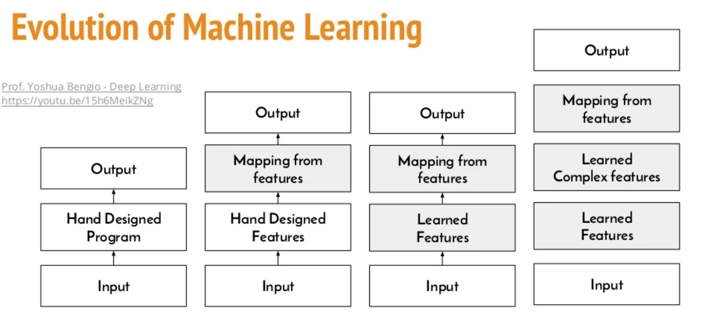

# Terminology

When talking about Machine Learning, 
we talk about a subset of the generic Artificial Intelligence field:

In fact, Artificial Intelligence is composed of: 
- Data Mining (DM)
- Machine Learning (ML)
- Deep Learning (DL)

A classification of the different AI techniques is as follows:
* Machine Learning.
* Fuzzy Logic Systems.
* Expert Systems.
* Bayesian Networks.
* Evolutive Algorithms.
* Case-Based Systems

**Machine Learning**

It is the field of study that gives the ability to learn without 
being explicitly programming. (Arthur Samuel - 1959)

The most commonly used type of machine learning is a type of AI
that learns A to B,
or input to output mappings.
This is called **Supervised Learning**.

Examples of Supervised Learning:

This set of AI called supervised learning,
just learns input to output,
or A to B mappings.

On one hand, input to output,
A to B it seems quite limiting.

But when you find a right application scenario,
this can be incredibly valuable.
Now, the idea of supervised learning
has been around for many decades.
But it's really taken off in
the last few years

If you want the best possible levels of performance,
then you need two things: 
- a lot of data (Big Data)
- you want to be able to train a very large neural network

So, the rise of fast computers, including Moore's law,
but also the rise of specialized processors such as
graphics processing units or GPUs, has enabled many companies,
not just a giant tech companies, but many many other companies to
be able to train large neural nets on
a large enough amount of data in order to get
very good performance and drive business value

----

## Machine Learning Versus Data Science

Machine Learning: mapping from input A to output B
Fo example guess the House price:

Instead, the output of a Data Science projects are the Insights, 
that can help you make Business decisions, for example
which type of house to sell.

---
* The output of a Machine Learning is software

* The output of a Data Science project is a presentation.

----

The idea is that such machines (or computer programs) once built will be able to evolve and adapt 
when they are exposed to new data.

**Machine Learning** means a subset of AI that specifically seeks to be able to provide computer systems
with the ability to learn new knowledge for which machines had not been previously explicitly
programmed.

The learning and ability to generalize knowledge based on information to deduce rules is carried
out by different algorithms, that are only mathematical functions that will adjust specific
parameters.

So **Machine Learning** refers to a set of mathematical functions that will always
require **input data** thanks to which they will be able to adjust certain parameters within the
mathematical functions in order to carry out a **generalization** that allows them to extract relevant
insights or conclusions from new future sets of information to which they have never been
exposed before.

References:

* [Difference between Artificial Intelligence, Machine Learning, and Deep Learning](https://www.codesofinterest.com/2016/11/difference-artificial-intelligence-machine-learning-deep-learning.html)

* [Using deep learning to listen for whales](https://danielnouri.org/notes/category/bioacoustics/)

* [Deep learning overview ](https://www.slideshare.net/natalinobusa/deep-learning-overview-and-practical-use-in-marketing-and-cybersecurity)

## Some Machine Learning applications

- Detecting people in photos
- Autocomplete text
- Voice to Text transformation
- Content recommendations: Numerous industries (retail, e-commerce...) have multiple contents that are provided to their users
in a personalized way according to different criteria
- Robots: systema able to interact with the environment 
- Medical diagnosis: These systems are able to learn to recognize many
pathologies and diseases by analyzing medical images, and on numerous occasions they do so
more accurately than a doctor.
- Video games: for the different artificial agents present in the game
- Virtual Reality
- Virtual Assistants
- Information Retrieval Systems like Search Engines:  Determining what content is relevant or not is done in part by these algorithms
- Mail Spam Filtering

All these systems are made possible by the ability of these algorithms to extract numerous
insights from a huge amount of available data.

## Machine Learning classification

1) Supervided Learning
2) Unsupervised Learning
3) Reinforcement Learning

All these algorithms are able to learn from a certain set of available data,
and they are able to generalize what they have learned to new data they have never
seen before.

---
### Supervised Learning
Example: Consider that we have a set of ùdata and
we want to identify which animal is this.

In the case of **Supervised Learning** The starting point would be a few cases in which the category
to which they belong at the outset

-> the learning of the
system would be generalized in order to identify new animals from their features.

So, with Supervised Learning we build a **Predictive Model**
and then we apply this Model to have the output, based
on every new input, not processed before.

These supervised learning systems can make adjustments 
to the parameters of the algorithms, according to the initial 
data provided to the system, 
in order to be able to identify animals with values 
different from the training data.

the system will automatically compare its response with the real response and see if it has
succeeded or not, and in case, it will reset the parameters
to try again.

## How it works
These systems could be seen as black boxes in which there is a mathematical
function (with certain parameters or coefficients that can be adjusted) that relates input
parameters (traits) to a specific output.
 -  ÿ = 𝐹(𝑋)

The function F receives the values of the input parameters (X)
- each row of the array is the data available for each animal

There is a vector-column **y** that represents the different types of animals
(one per row) that the system thinks that correspond to the data that is in X for
specific values of the function parameters

With that data predicted in the system, it could try to minimize the following:
- min (𝑦 − ÿ)

where **y** is the real data of animals.

The system will try to find the **best combination** 
of the parameters where the difference is the smallest (min)

The vector **y** can be autogenerated by another software.

Set of algoruthm can be sub-categorized into
- Classification
- Regression

#### Classification

The output variable could be a category
such as the previous case of animals, where we try to
predict whether this is a "duck", a "dog".

#### Regression

The output varabile is a real number (example when predicting
the **price** of a house.)

---
### UnSupervised Learning

Going back to the case of animals, imagine that 
the category associated with the available features is not available.

For all cases where **classes** associated with **input parameters are not available**,
these algorithms are able to learn and generalize knowledge 
based on datasets without categories or **without labels**.

These systems look for relationships between the data values in each of the records
to **try to infer relationships between them**.

Techniques

- segmentation or clustering: attempt to group records that it considered similar within groups (or clusters).

In this case, animals have no labels, and so the system try to "guess" or "infer"
the group of similar animals, based on the patterns or information
detected by the algorithm.

---

### Reinforcement Learning

Reinforcement Learning (RL) is one of the newest and most recent paradigms in recent years
thanks to the advancement of various academic research and the success it has had in its
application to complex problems such as **Google's AlphaGo system** and its victory in a GO game

In the RL the distinctive element is the **reward**: 
the agent have different actions to perform, and by:
- trial-error
- award-reward

are the results of the tests of its action when the system interacts with the environment.

The system at the end ill deduce what is the optimal combination for specific external conditions,
so the reward function can be optimized.

Example: in the Go game, the system have to learn what are the actions
will lead to maximize his objective function

(that is to win for example)

This is discovered autonomously by the
system without the need for human supervision

## Definition of Deep Learning

Deep Learning is a subset of Machine Learning, 
all working towards the common goal of creating an intelligent machine.

What the Neural Network does is:
* Take the input A 
* Produce the output B (the price)

Today the terms Artificial Neural Network and Deep learning
and interchangeable terms, to mean essentially the same thing

**Deep Learning** takes the functioning of the **human brain** as inspiration and attempts to define different
architectures of neural connections that simulate in some way their functioning  

[Quora: other "fields" or “branches” of AI ](
https://www.quora.com/What-are-other-fields-or-%E2%80%9Cbranches%E2%80%9D-of-AI-outside-of-but-that-are-just-as-interesting-and-powerful-as-machine-learning
)

---

    

* Artificial Intelligence
  * Machine Learning 
    * Deep Learning (Neural Network)

* [A comprehensive survey on machine learning for networking: evolution, applications and research opportunities](https://jisajournal.springeropen.com/articles/10.1186/s13174-018-0087-2)

---

## About the hardware in Deep Learning

* [Wave Computing Targets Deep Learning
](https://www.bdti.com/InsideDSP/2016/11/17/WaveComputing)

Most hardware acceleration here has been done using **GPGPU** 
(i.e. "**general-purpose computing on graphics processing units**

However conventional heterogeneous processors such as GPUs aren't ideal for deep learning computations.
Deep Learning networks.
are constructed from dataflow graphs and programmed using deep learning software
There are bottlenecks between the parallelizazion-to-serial-to-parallel
between CPU and GPU.

It's preferable to directly compile the deep learning
network dataflow graph to a Wave Computing-optimized
graph, which can then be run directly on the DPU
(Data Processing Unit)

## Data mining

Data mining is an application of Machine Learning and Deep Learning.
It's a statistical technique, and it's not part of Machine Learning, 
but another branch of Computer Science.

So, Data Mining is an application of Artificial Intelligence:

- Anomaly detection
- Association rules
- Grouping
- Predicitons

## Automated Reasoning and Search

**Reasoning** (ragionamento):
The ability to solve problems, draw conclusions, learn from the facts, 
establish casual and logical connections between the facts.

Features common to all symbolic AI:
 - **Conceptual model**: using symbols, it can describe the different problems 
that can be described by the system. Problem, operations and solutions are represented.
 - **High level language** representation to describe the problem in a general way
 - **A general porpoise algorythm**, that should find the solution

We have **two families** of algorythm and techniques:
1) Automatic reasoning
2) Search based

---
### Automatic Reasoning 

The area of AI that studies how to create the systems able to "reasoning" in a similar way humans do.
They are **expert systems**.
It was in the 1970 that A system to diagnoses the infectios of the blood was 
developed: it generated solutions based
on personal information of the patient.
The system applied an inference system of 500 rules.

Also here we have:
1) a **Conceptual model**, defined by a group of experts
2) The **High Level Language** (the First-Order preposition logic)
3) The **Inference Mechanism** : the algorythm to solve the problem based on the conceptual model.

Depending on how this type of information is defined, it is possible
to define different models of reasoning:

#### Reasoning based on Rules
#### Case-Based Reasoning (CBR)
#### Based on Bayesian inference
#### Fuzzy Recognition
#### Other types

---
### Search 

**Data mining** includes
knowledge and work on information systems that act as a repository for such data (database
systems), as well as data extraction and preparation techniques

## Prepare Local environment

### Environment - POSIX
**Install python3. Last Version is now 3.10.6**

**Create a hidden folder with the local python environment with this command**

(We give the arbitrary name of ml_venv.It is just the name of a folder)

`python3 -m venv .ml_venv`

**Activate the environment**

`source .ml_venv/bin/activate`

**Install the requirements**

pip install matplotlib
pip install pandas
pip install scikit-klearn
pip install statsmodel

`pip3 install -r requirements.txt`