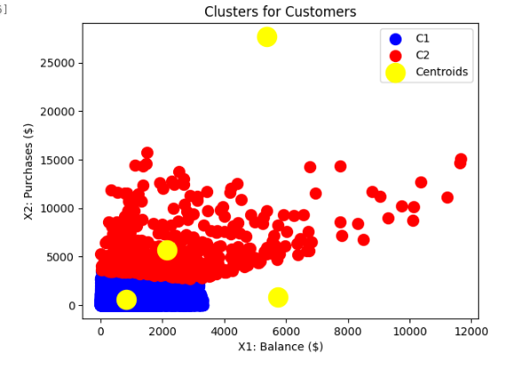

In this folder there are the Jupiter notebooks valid to analize with Unsupervised learning, 
the dataset of Customers (CC_General.csv)

with these Unsupervised Learning techniques:

- K-Means
- K-Means with Elbow techniques
- K-Means with Silhouette method
    