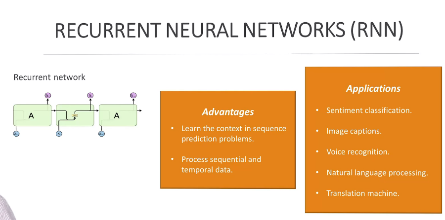
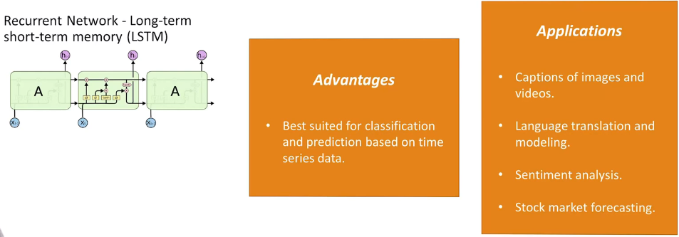
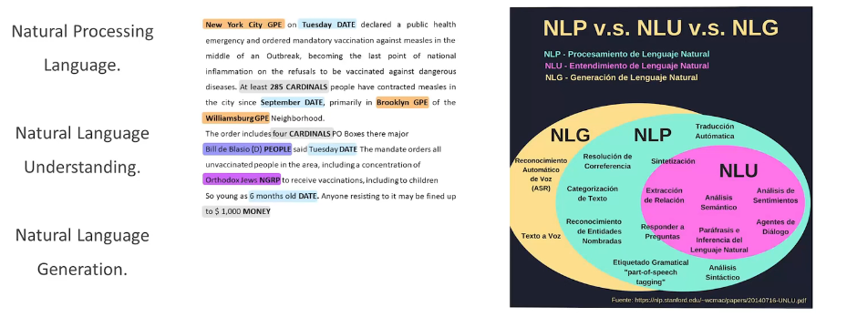

# Recurrent Neural Networks (RNNs) 

Recurrent Neural Networks (RNNs) are particularly convenient and advantageous in tasks involving sequential or time-series data, where the order of data points matters. Here are some scenarios where RNNs are beneficial and the advantages they provide:

### 1. **Sequential Data Processing:**
   - **Convenience:** RNNs are well-suited for tasks where the input data has a sequential or temporal structure, such as time-series analysis, natural language processing (NLP), speech recognition, and video analysis. They can naturally capture dependencies and patterns over time.

### 2. **Temporal Dependency Handling:**
   - **Advantage:** RNNs maintain an internal state (hidden state) that can capture information from previous time steps. This allows them to handle temporal dependencies and context in sequential data, making them effective for tasks that involve understanding the context of past observations.

### 3. **NLP and Language Modeling:**
   - **Convenience:** RNNs are widely used in NLP tasks, including language modeling, machine translation, and sentiment analysis. They can effectively model the sequential nature of language and capture dependencies between words in a sentence.

### 4. **Speech Recognition:**
   - **Convenience:** RNNs are employed in speech recognition tasks to process sequential audio data. They can capture long-term dependencies in speech signals and are capable of recognizing patterns in the temporal domain.

### 5. **Stock Price Prediction:**
   - **Convenience:** For time-series forecasting tasks, such as predicting stock prices or weather conditions, RNNs can be convenient. They can capture patterns and trends in the historical sequence of data points.

### 6. **Generative Modeling:**
   - **Advantage:** RNNs are used for generative tasks, such as generating sequences of text, music, or images. The ability to capture dependencies in sequential data makes RNNs suitable for generating coherent and contextually relevant outputs.

### 7. **Online Learning and Adaptive Systems:**
   - **Advantage:** In online learning scenarios or systems that adapt to changing input over time, RNNs can be advantageous. They can continuously update their internal state based on new information, allowing for adaptability to changing patterns.

### 8. **Variable-Length Inputs:**
   - **Advantage:** RNNs can handle variable-length sequences, making them suitable for tasks where input lengths vary. This flexibility is beneficial in applications like natural language understanding, where sentences can have different lengths.

### 9. **Memory and Context Maintenance:**
   - **Advantage:** RNNs have a form of memory through their hidden states, allowing them to maintain information about past observations. This is advantageous for tasks that require remembering context over long sequences.

### 10. **Backpropagation Through Time (BPTT):**
   - **Advantage:** RNNs use the backpropagation through time algorithm to update weights during training. This enables them to learn dependencies across multiple time steps and adapt to the sequential nature of the data.

While RNNs offer these advantages in handling sequential data, it's important to note that they have challenges, such as the vanishing gradient problem, which can impact their ability to capture long-term dependencies. As a result, more advanced variants of RNNs, such as Long Short-Term Memory (LSTM) networks and Gated Recurrent Unit (GRU) networks, have been developed to address these challenges and further enhance the modeling of sequential dependencies.

## Natural Language Processing (NPL)

Engineering plays a crucial role in the field of Natural Language Processing (NLP), contributing to the development of technologies and applications that enable computers to understand, interpret, and generate human language. The significance of engineering in NLP lies in its ability to bridge the gap between computational models and the complexities of natural language, leading to a wide range of social applications with significant societal impact. Here are some key aspects and potential future applications:

### Significance of Engineering in NLP:

1. **Algorithms and Models:**
   - Engineers develop algorithms and models that form the foundation of NLP systems. These include machine learning models, neural networks, and statistical methods designed to process and understand linguistic patterns in data.

2. **Data Preprocessing:**
   - Effective engineering involves preprocessing and cleaning large datasets for training NLP models. Engineers design methods for tokenization, part-of-speech tagging, and other preprocessing steps to prepare data for training and evaluation.

3. **Feature Engineering:**
   - Feature engineering is critical in designing representations of language that capture relevant linguistic features. Engineers work on creating meaningful representations, embeddings, and features that enhance the performance of NLP models.

4. **Model Training and Optimization:**
   - Engineers are involved in training and optimizing NLP models. This includes selecting appropriate architectures, tuning hyperparameters, and implementing optimization techniques to ensure models generalize well to diverse language patterns.

5. **Interfacing with Applications:**
   - Engineering facilitates the integration of NLP technologies into various applications. This includes developing APIs, user interfaces, and integrating NLP capabilities into platforms ranging from chatbots and virtual assistants to search engines and recommendation systems.

6. **Ethical Considerations:**
   - Ethical considerations are an integral part of engineering NLP systems. Engineers work to ensure fairness, transparency, and accountability in NLP applications, addressing issues related to bias, privacy, and the responsible use of language technologies.

### Future Social Applications:

1. **Improved Human-Computer Interaction:**
   - Future NLP applications will enhance human-computer interaction, allowing users to communicate with machines more naturally. This includes advanced virtual assistants, voice-activated devices, and chatbots that understand and respond to users' language in a human-like manner.

2. **Enhanced Accessibility:**
   - NLP technologies have the potential to improve accessibility for individuals with disabilities. Future applications may include advanced speech recognition systems, language translation tools, and text-to-speech applications that make information more accessible to diverse populations.

3. **Language Understanding in Healthcare:**
   - NLP can play a significant role in healthcare by improving the understanding of medical records, research literature, and patient interactions. Future applications may include advanced diagnostic tools, personalized health recommendations, and natural language interfaces for medical professionals.

4. **Multilingual Communication:**
   - Advanced NLP models can facilitate seamless multilingual communication. Future applications might include real-time language translation in various communication platforms, making it easier for individuals to connect and collaborate across language barriers.

5. **Content Moderation and Safety:**
   - NLP technologies can be employed to enhance content moderation on online platforms. Future applications may include systems that can effectively detect and mitigate harmful content, hate speech, and misinformation, contributing to a safer online environment.

6. **Educational Support:**
   - NLP applications can assist in education by providing personalized learning experiences, automated grading, and intelligent tutoring systems. Future developments might include virtual learning assistants that understand and respond to students' natural language queries, offering tailored educational support.

7. **Social Sentiment Analysis:**
   - Advanced sentiment analysis tools based on NLP can contribute to understanding public opinion and sentiment on social media. Future applications may include tools that help monitor and respond to societal trends, public sentiment, and emerging issues.

While the potential applications of NLP are vast and promising, it's essential to address ethical considerations, privacy concerns, and potential biases in the development and deployment of these technologies. Responsible engineering practices are crucial for ensuring that NLP applications benefit society while minimizing potential risks and negative impacts.