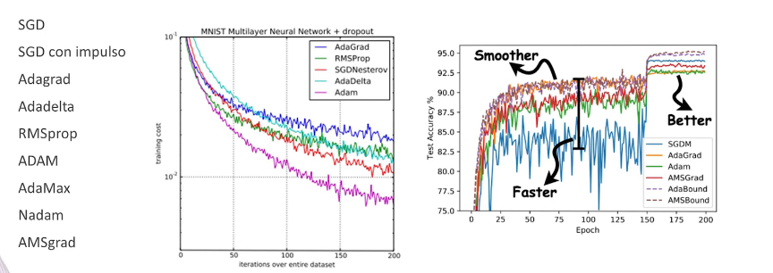

The parameters of a neural network, often referred to as weights and biases, play a crucial role in determining the model's behavior and performance. These parameters are learned during the training process, where the network adjusts them to minimize a certain objective or loss function. Optimizers are algorithms that guide this adjustment, helping the neural network converge to a state where the loss is minimized. Different optimizers have been developed, each with its characteristics. The choice of an optimizer depends on factors such as the nature of the problem, the dataset, and computational considerations. Here's an overview of the role of parameters and common optimizers:

### Role of Parameters in a Neural Network:

1. **Weights and Biases:**
   - Neural networks consist of layers of interconnected nodes (neurons). The parameters of the network are the weights (coefficients) and biases associated with the connections between these neurons. These parameters are learned during training to capture the relationships within the data.

2. **Learning Process:**
   - During training, the network adjusts its parameters iteratively to minimize a chosen loss function. The process involves computing gradients, which indicate the direction and magnitude of the steepest increase in the loss. The optimizer uses these gradients to update the parameters.

### Common Optimizers:

1. **Stochastic Gradient Descent (SGD):**
   - SGD is the basic optimization algorithm used in neural networks. It updates the parameters by moving in the direction opposite to the gradient of the loss with respect to the parameters. It has variants like mini-batch SGD, where a subset of the data is used in each iteration.

2. **Adam (Adaptive Moment Estimation):**
   - Adam combines ideas from RMSprop and Momentum. It adapts the learning rates of individual parameters based on their historical gradients. Adam is widely used due to its efficiency and robustness across different types of data.

3. **RMSprop (Root Mean Square Propagation):**
   - RMSprop adjusts the learning rates for each parameter based on the magnitude of recent gradients. It helps mitigate the vanishing and exploding gradient problems and is especially useful in recurrent neural networks (RNNs).

4. **Adagrad (Adaptive Gradient Algorithm):**
   - Adagrad adapts the learning rates for each parameter based on the historical squared gradients. It performs well on sparse data but may have issues with accumulating very large gradients over time.

5. **Adadelta:**
   - Adadelta is an extension of Adagrad that addresses its issue of monotonically decreasing learning rates. It uses a running average of squared gradients to adapt the learning rates dynamically.

6. **Nadam (Nesterov-accelerated Adaptive Moment Estimation):**
   - Nadam combines Nesterov's accelerated gradient descent with the adaptive learning rates of Adam. It aims to provide the benefits of both approaches.

### Criteria for Selecting an Optimizer:

1. **Convergence Speed:**
   - Different optimizers may converge to the minimum of the loss function at different rates. Some optimizers adapt more quickly to the data and converge faster than others.

2. **Memory Requirements:**
   - Optimizers that keep track of historical gradients (e.g., Adam, RMSprop) may require more memory, especially when dealing with large datasets.

3. **Robustness:**
   - The robustness of an optimizer refers to its ability to handle different types of data and model architectures. Some optimizers are more robust across a variety of scenarios.

4. **Computational Efficiency:**
   - The computational efficiency of an optimizer is crucial, especially when dealing with large-scale datasets and complex models. Some optimizers are more computationally efficient than others.

5. **Hyperparameter Sensitivity:**
   - The performance of some optimizers is sensitive to their hyperparameters (e.g., learning rates). It's important to consider how sensitive an optimizer is to hyperparameter choices and whether it requires extensive tuning.

6. **Parallelization:**
   - Some optimizers are more amenable to parallelization, making them suitable for distributed training across multiple GPUs or TPUs.

7. **Type of Data and Problem:**
   - The nature of the data and the problem at hand can influence the choice of optimizer. For example, certain optimizers may perform better on sparse data or in the presence of noise.

8. **Ease of Use:**
   - The ease of use of an optimizer is also a factor. Some optimizers have fewer hyperparameters to tune, making them simpler to use, while others may require more careful tuning.

The selection of an optimizer often involves empirical testing and experimentation to find the one that works best for a specific task and dataset. It's not uncommon to try multiple optimizers and compare their performance during model training. Additionally, ongoing research in optimization algorithms may introduce new techniques that offer improvements in various aspects.