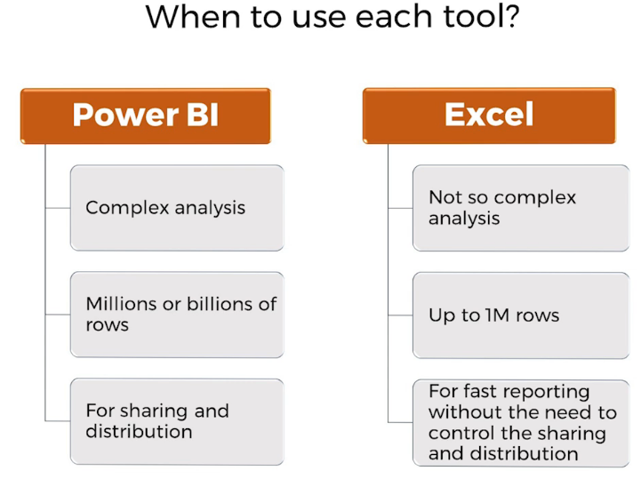
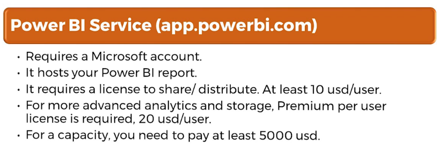

# Power BI

Microsoft Power BI is a powerful suite of business intelligence tools that has gained widespread
popularity among businesses and data analysts.

Power BI is a collection of software services, applications, and connectors that work together to
turn raw data into meaningful insights through interactive visualizations and reports. It is
designed to help organizations make data-driven decisions by transforming data from various
sources into easy-to-understand visualizations. Power BI comprises several components,
including 
- Power BI Desktop, 
- Power BI Service, 
- and Power BI Server.

It offers a rich set of features for
- data transformation, 
- data modeling, 
- and data visualization, 

making it an ideal tool for data analysts and business users

. Use Power BI when:
▪ You need to create interactive and dynamic visualizations or reports: Power BI excels at
creating visually engaging and interactive reports that allow users to explore their data
and discover insights. With Power BI, you can create a wide range of visualizations, from
simple bar charts to complex custom visuals.

▪ You need to combine data from multiple sources or perform complex data
transformations: Power BI offers robust data transformation capabilities through Power
Query, enabling users to import, clean, and transform data from various sources. This
makes it an excellent choice for working with data from multiple sources or when
complex data transformations are required.

▪ You want to share your insights and collaborate with others on a secure, cloud-based
platform: Power BI Service provides a secure environment for hosting and managing
your data, reports, and dashboards. With built-in features for sharing and collaboration,
Power BI makes it easy to work with others on data-driven projects.

▪ You require advanced analytics, such as AI-driven insights or predictive analytics: Power
BI offers a range of advanced analytics features, including integration with Azure
Machine Learning, AI Insights, and support for R and Python scripts. This makes it an
ideal choice for users who need to perform more sophisticated data analysis.

### Differences PowerBI Desktop and PowerBI Service

