### DATA CLEANSING WITH TALEND DATA PREPARATION

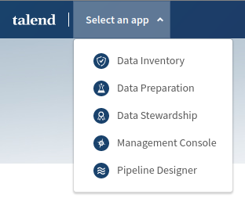

In the Data Wuality management, Talend is able to:

- Profiling to discover recurring patterns in data and data formats.
- Data Cleansing of invalid data in the validity and consistency data dimensions.
- Data normalization.
- Grouping of data.
- Detection of outliers.
- Data enrichment, by creating new columns based on others.
- Data blending
- Data masking or data obfuscation

### Process

**Add preparation:**
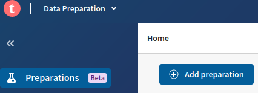

 A preparation is the
result of the different steps applied to cleanse a dataset.

A preparation takes a dataset and applies a recipe to produce an outcome. The original data is
never modified.

**Add dataset**:

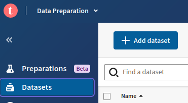

Problem: Let’s imagine we have received the data
obtained from an event, which includes valuable data
on customer contact information and their classification as **potential customers** for marketing
campaigns. 

It is necessary to discover, cleanse and prepare the information on potential
customers before analyzing the ROI of the event and integrating the market research data into
other information systems of our company, such as CRM.

---

### BASIC CLEANSING FUNCTIONS 

**Automated Profiling**

First of all the first step to do is profiling, 
to determine how good or bad our data is and obtain statistics on the data.

Talend is able to identify the type of data and for each field of the dataset, it performs a
distribution of its values, presenting the assessment in a very visual way

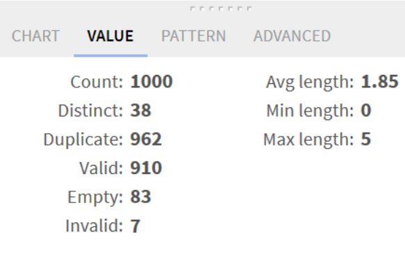

### Data quality bar

Talend's automated profiling provides us with the data quality bar. 

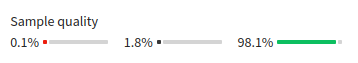

- We can filter values with invalid format

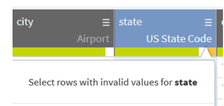

In the Data Quality Management process, we can fix the values that are not consistent
or that do not follow the standard format (for example for the State field).

For the email, since is the most important field, we delete the records that do not have
a valid email.

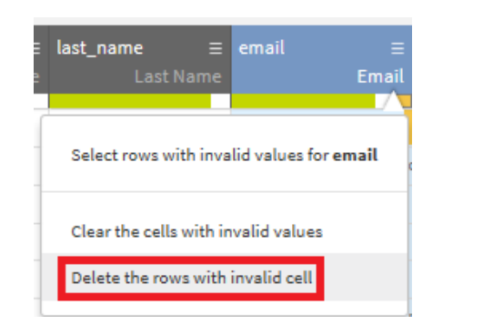

**Suggestion System**
Another powerful help tool that **Talend Data Preparation** provides are suggestions, which is the
predictive ability to activate a system of recommendations of cleaning and wrangling functions
that can be applied depending on the field of the dataset where you are performing the
preparation.

Example: Remove trailing and leading characters" to remove the blank spaces

The data cleaning functions available in the suggestion system are classified by type. There are
functions for STRINGS, DATES, CONVERSIONS, SPLIT, etc.

**Recipes**
In Talend Data Preparation, data cleaning and data wrangling are steps that are added to the
preparation recipe.

Example of Recipe:

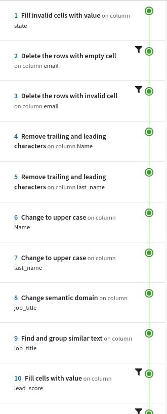

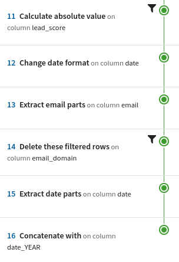

---
### DATA NORMALIZATION
 
It makes sense that there would be business rules aimed at ensuring
that proper names are always recorded in uppercase or lowercase, as well as that dates have a
certain format.

Talend Data Preparation helps us in the normalization or standardization of data to comply with
the basic business rules related to the formats of the field values.

- Example: Name and last_name columns will be changed in uppercase

##### Data Types

Talend associates data type based on the content to help us discover data types.
However, we can also change those suggestions based on our own experience.

##### Grouping

Grouping makes it possible to find records in fields that have similar content and group them
together by changing the text to match, for example, for performing segmentation in marketing
campaigns.

To **reduce the frequency of different types** of occupations, we are going to group similar occupations into one, by using the "Find and
group similar text" function.

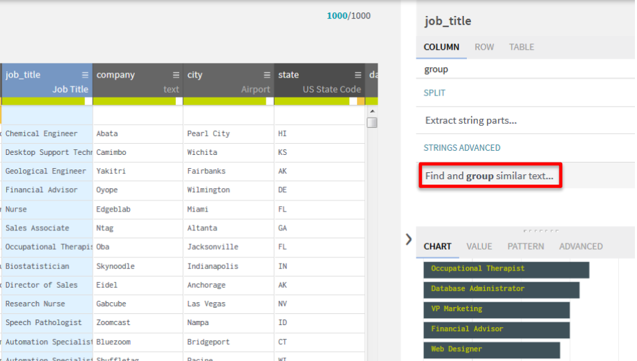

##### Outliers

w Talend Data Preparation helps us to detect numerical outliers.

It is reasonable to assume that the value 999 has been used as the default value in that field. A
cleansing operation should be performed to change it by using the “Fill cell with value” function,
replacing 999 with 0.

The same could be done with negative numbers, assuming that
it was an error, and we use "Calculate Absolute value".

##### Normalization of Dates

First of all we select the date column and observe its formats in the Pattern view to better see the different formats of
dates used.

Some dates have been entered with the European format (d/M/yyyy) and others use the
American format (M/d/yyyy). Also, some use a hyphen (-) to separate the parts of the date and
others use the forward slash (/). Standardizing dates means using the same format for all dates.
The format that has been established for the date field is: dd/MM/yyyy.

The "Change date format" function allows dates to be standardized.

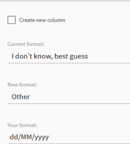

##### Normalization of emails

Another business rule that we must comply with is related to the email field. The sales
department of our company, which is also a user of the corporate CRM, prefers not to use
generic domains; for example, it does not want to run advertising campaigns to companies
whose emails are from Google (Gmail). 

When selecting the email field, Talend suggests using the “**Extract email parts**” function. We
should add it to our recipe and thereby obtain two new fields, one of which is the email domain.

When selecting the domain, the different existing values can be seen in the distribution graph at
the bottom right. We must apply a filter in the domain field, selecting the bar that represents the
values of the gmail domain

We can proceed to delete them and therefore apply the business rule agreed upon by using
Talend's suggestion, “**Delete these filtered rows.**”

### DATA ENRICHMENT

Sometimes we need to create new values in our dataset based on other columns to enrich the
original data in the dataset. For data enrichment, several techniques can be used.

##### Data Wrangling

Following the example, where we want to send information to possible customers, 
the different salesmen for each campaign.

For this reason, we must identify the acquisition campaign in which the information regarding
each customer has been received. We will do this with Talend by creating a new field derived
from the information from other fields in the dataset. 

**Goal: we would like to associate each record with a campaign name, so we
will extract the year from the date field to create a new field.**

The function that allows the extraction of each of the parts of a date type field is 
"**Extract date part.**”

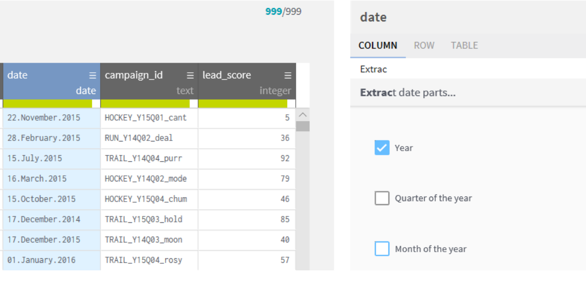

Now we use the function "**Concatenate with**" 

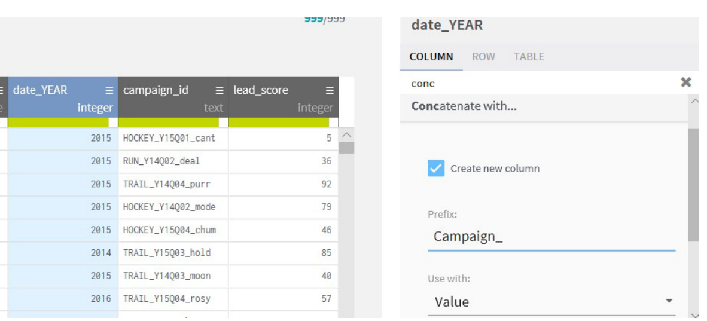

#### Data Blending

It refers to connecting data from different sources as another data
enrichment technique. Data blending between sources allows you to use fields from other
sources to include them as meaningful information.

n our example, the linked field for the blending operation is the state code in the state field. 

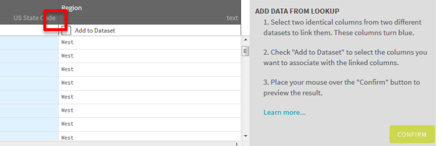

#### Exporting

The last operation in data preparation is to use the information that we now know meets the
data quality required to generate value. In our example, with the potential customer information
properly prepared, we will now integrate it into the corporate CRM. For this, we must provide the
data in a file.

The generation of the prepared data file is carried out with an export operation, using the Export
button in the upper right part of the screen.

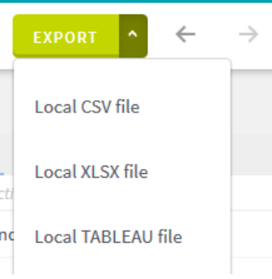

