Today, data has become much bigger and messier. Even the use cases, which were clearly
defined in the past, have become experimental in nature

Each type of users in the organizations requires different data that have been cleansed
and wrangled differently. But there is one commonality: everyone wants data quickly and the
number of use cases they are working with is growing exponentially

### DATA CLEANSING WITH TRIFACTA

**Data Wrangling** is the process of
cleaning, preparing and combining data sets for easier access and analysis.

As we saw in the study of Data Quality Management, the main activities that will enable a business
to have data that generates value are: 
- Data access
- Data Extraction
- Data profiling
- Data Cleansing
- Data Integration
- Data enrichment
- Data delivery

####  Functions and transforms available in Trifacta

Trifacta is a platform that combines the preparation and cleansing of data for analysis. It consists
of five steps:

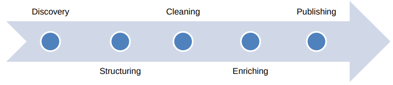

The goal of these tools is to reduce the time spent on data
cleaning so that the data analyst can focus on the process of gaining insights from the data

However, before moving on to data exploitation, we need quality data and this is where tools like
Trifacta come into play. This tool not only provides transforms to increase the quality of the data,
but also includes a **suggestion system** (Like Talend does)

#### Flows

A project in Trifacta is called a flow. A flow requires at least one dataset. Flow refers to a sequence
of data transforms (recipe).

A flow allows you to visualize the relationships between datasets and how they are linked. 

They also have automated change propagation, which means that changes made to any dataset are
automatically applied and saved to all affected datasets.

**Wrangle** is the domain-specific language used to build transform recipes in Trifacta Wrangler.

- **Recipe**: a sequence of transformations that are applied to a dataset in order to generate a new,
higher quality or enriched dataset.
- **Transform**: a single action applied to a dataset. 
- **Function**: Within some parameters of a transform, it is possible to specify a function: a computational action performed on one
or more columns of data. For example, splitting full names into first and last names,
creating two columns from one initial column

---
#### Steps

The first step in DataPre is to create a Project and then a dataset.

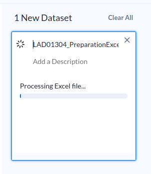

Next, click on the Import & Add to Flow button to proceed to load the data and add the dataset to
the Flow

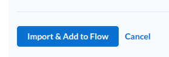

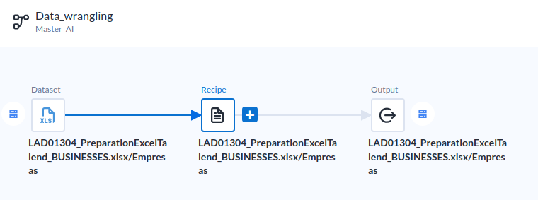

We can add a new Recipe or Edit the one that DataPrep already created:

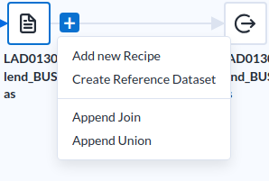

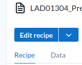

Like Talend, Also DataPrep by Trifact offers an overview of the data, 
the percentage of good or missing data etc. General statistics. 
This is important in the phase of profiling.

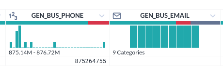

We can switch the view from "**Data Grid**" and "**Columns**"

If a Column doesn't aport any contribution, we can delete it:
for example this one that is empty:

And the suggestion is to delete it:

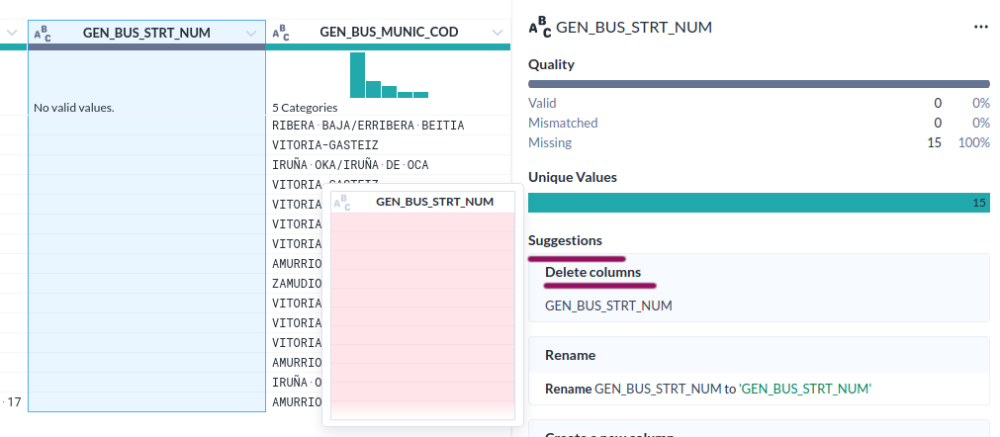

Don't forget to apply this step to the Recipe:

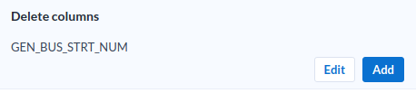

Another operation is **Normalization**
like make the data to be all in Uppercase, for example.

To do this we select the column and we observe the suggestions:

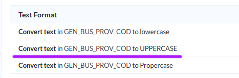

---

A dataset may have **incorrect** values.

DataPrep by Trifacta can show us the incorrect values with the quality bar.
For example, in the email:

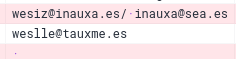

And, if we select the "slash" / 
Trifacta automatically suggest a "split" operation based on the symbol we selected:

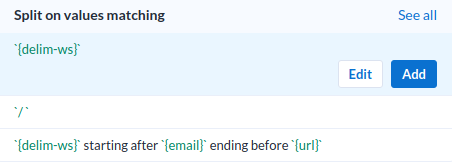

---

A dataset may have **empty** values:
and the suggestion can be: delete rows:

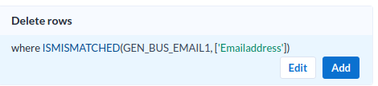

---

#### Data normalization

We have the case in which we have more than one phone number in a single row.

after dividing by "Slash" / like we did before with another field, 
we see that there is another wrong record.

In this case it has 10 digits and it is impossible to guess the true number:

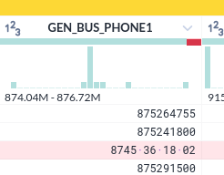

---

#### Separate fields

Now we are going to separate the columns of the names:

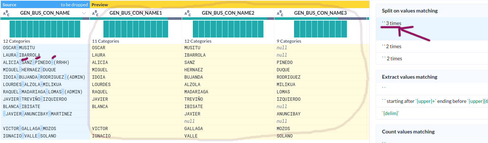

---

Replace Parentesis with nothing:

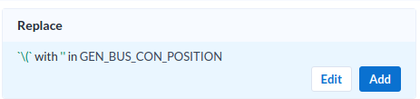

