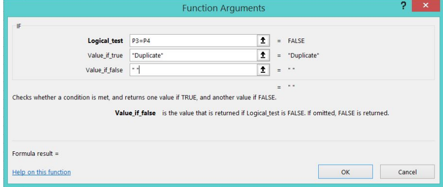
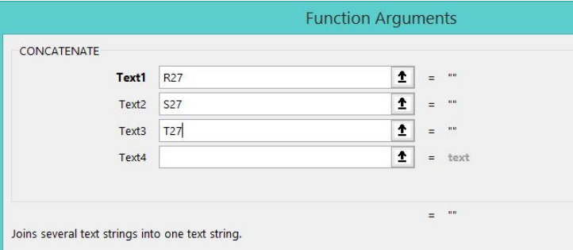

### Cleaning steps with Excel

 - Create a new tab in the Sheet
 - Use the function UPPER to capitalize the headers
 - Replace the empty field of the phone number with "No recorded"

#### When we have multiple fields all together
and we want to separate them in another new field:

- first identify a separator and replace with a comma (just an example)
- Use the function "Text to Column" to split the contact information

- Replace text when the field is only numebr (like phone numbers)
- Use functions LEFT or RIGHT to substring a text

#### Find duplicate data

- Use the function IF:
IF they are the same, the condition
"Value_if_true" will be met and a "Duplicate" label will appear.

Drag and drop the function to apply to the rest of the cell in the column.

#### Concatenate data

- Use the function CONCATENATE
For the arguments, we select the values of the cells that we want to join, and then apply the
result of the formula to the rest of the column

### Remove blank spaces

- Use the function TRIM
