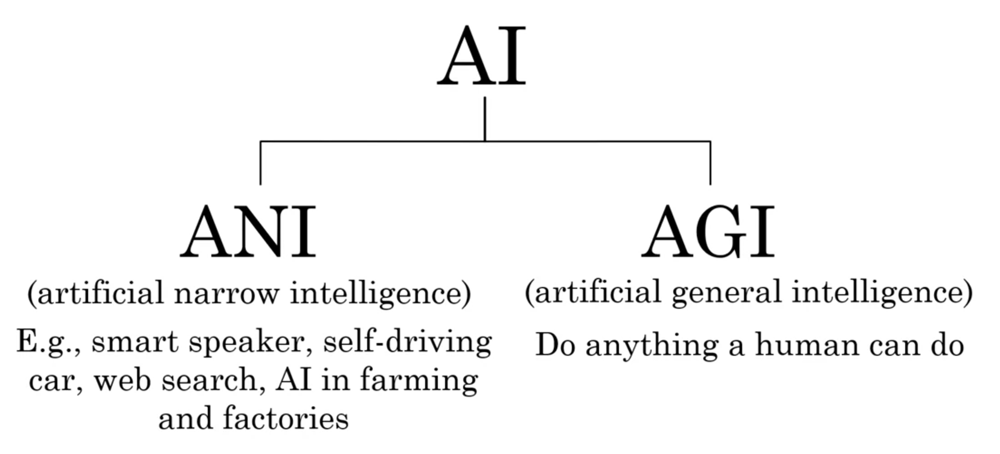

# Artificial Intelligence

##### AI is any project or system that tries to understand and replicate the behaviour of the human beings.

---

In the book "Artificial Intelligence: a modern approach" Russel and Novig identified 4 groups that encompasses different definitions of AI:
 - systems that think like humans
 - systems that think rationally
 - systems that act like humans
 - system that act rationally

To meet these four premises, AI-based systems that seek to emulate human behaviurs, must require ad least:
1) perception
2) reasoning
3) predictive
4) manipulate skills

As a consequence, AI is divided into multimple areas:

1) **Knowledge representation**: it's the AI area that is in charge of finind the best way to represent information
It collects and order the information, creating hierarchies  and relationships between the element represented.
2) **Automated reasoning**: it's the area of AI in charge of developing algorithms to simulate knowledge interface.
The ability to inference (dedurre) is human ! The computer will be able to solve the problem using 
the knowledge base previously established and techniques of logical satisfiability.
   (Example of the Rubik's Cube)
3) M**achine Learning**: it's the area in charge of handling data processing to identify similar behaviour groups, trends
predictions. It trains a system with a set of data and returns a MODEL that will
classify or identify the new information.
- data processing to identify patterns
- elaboration of a model throught a training phase and a test phase.

4) **Natural Language Processing**: it's in charge of language recognition. It recognizes languages with the voice,
processes syntatically and semantically what it heards, understandint the subject.
Elaborates a sentence to reply
5) **Computer Vision**: it's in charge to recognize elements or situations by relative images or recordings.
Detenction of dangerous scenarios and emotions.
6) **Robotics**: encompasses all these areas we saw. AI plays a decisive role in evolving the software of these robots.

AI systems must have at least:
- perceptions
- reasoning prediction
- manipulation abilities

## AI: Narrow and General

The technological paradigm of AI was changing over the years to, distancing from the idea of
focusing on developing a system that perfectly emulated a human being

This new technological paradigm, known as 
**Narrow AI**, limited the scope and pretensions of this
technology, now proposing not to solve any kind of task with the same system, but to develop
systems **very specialized** in the resolution of certain specific tasks, where, again, they could solve
them more efficiently than a human being

## Key concepts:Agents, knowledge Representation

Strong AI: is a current that defends that machine to think
Weak AI: is a current that defends that machines acti with intelligence, but do not 
think for themselves

Turing Test
Global Turing test: which includes artificial vision to identify objects and manipulation
to be able to move them (robotics)

*Agent*: any entity, physical or virtual, capable of perceiving what happens
in the environment, processing it and/or interacting on it
Are identified as bots. when it has a physical body, it is called robot.

***Reactive agents***: Are only able to execute actions, if happens a condition, 
without taking into account the history of previous actions or situations. 
So the range of behaviors is limited by the knowledge base available, and are simple
interactions with humans is little as possible.

**Deliberate agents***: are fully aware of the environment and its changes,
the know how to cope with changes. The maximum expression of this type of behaviour would
be the autonomous agents, able to reason in any kind of situations

---
##### Agent's Architecture:

Scientists have implemented different architectures, that make it easy to work with agents.
For the reactive agents -> finite automata
for the deliberate agents -> BDI architecture

**Finite Automata**: a computational model that, each time it receives an input, 
it automatically computes or acts to produce and output.
 - deterministic: we have a status of the agent. 
We have an initial and a final state. 
We have transitions: a change of statu when the value is received as input
We have transition values: the values that the automation knows how to process
 - non deterministic: the difference is that the same value can be directed to more than
one status

**BDI Architecture**
It's the best know architecture when designing deliberative agents.
- B = Beliefs:the Agent believes in every of the facts stored in its knowledge
- D = Desires: are the priorities in regards the environment. Are set of goals
- I = Intentions: are the responsible to satisfy the agent desires.
---
##### Knowledge Representation #####

Representing the knowledge (information) is a key part, because it affects
the agent efficiency and intelligence.

Most of the information is organized in hierarchies and elements are connected with relationships.
- Facts: entity + relationships
- Entities: domain elements
- Relationships: in between two objects

When the fact is "true" means that is fully verified in the environment.

When we establish the hierarchy of objects, and their relationships,
the facts are initially true. We defined an *ontology*.
One ontology or a set of ontologies, create the **knowledge base**.

**Knowledge engineering process**
It is the elaboration of the ontologies, and consists of:
1) Identify the task to solve: what information we want to model.
2) Collect relevant knowledge. Source of information, or key elements, interview
form experts are collected.
3) Decide the component's vocabulary: a technical vocabulary is related to the area and how 
demanding the user is.

After these three steps, we have to sort that information with terms and relatioships.
We are **modelling the Domain Knowledge Base**.

Then, we must evaluate this knowledge base with different use Cases, 
before give it to the end customer.
The knowledge base must be sufficient.
System is the evaluated with experts. They will carry out the task.
The **evaluation of the inference procedure** is when the opinion
of the experts resolve the use cases previously defined.

At the end the Knowledge base will be refined and debugged, 
and update periodically.

Example of ontology is a Tree of relationships.